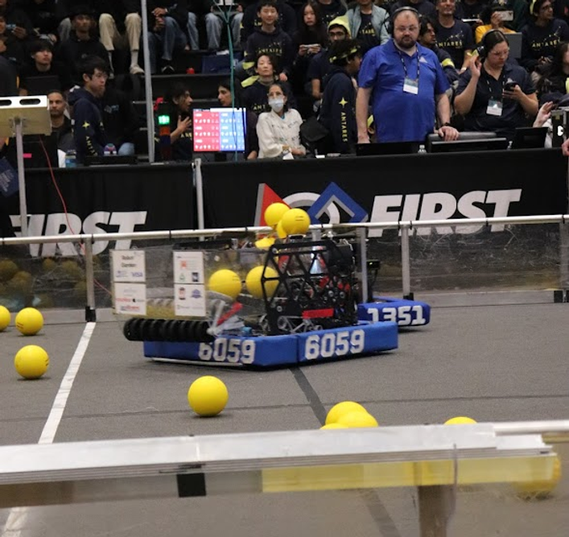
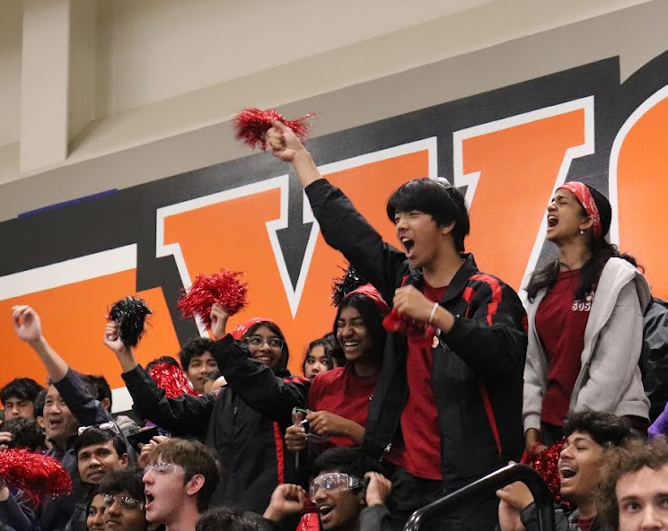
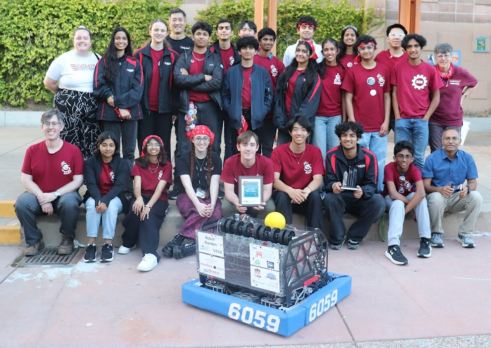

# Hi, I'm Pranav Pulavarthi👋

### 🚀 About Me

I am a senior at [Foothill High School](https://foothill.pleasantonusd.net/) in Pleasanton, California, with a deep passion for robotics, coding, design, and engineering. I serve as the co-president of our school's Computer Science Club. 

I enjoy hands-on experiences, participating in student hackathons and coding competitions because I firmly believe in learning by doing. I aim to pursue a degree centered around computer science and engineering to build innovative tools that solve real-world problems.

Outside of school, I'm on the software team for FIRST Robotics Competition (FRC) Team 6059, [System Overload](https://www.systemoverload.org). During the 2026 FRC REBUILT season, our team earned the Creativity Award for our unique robot design and implementation.

  
🔍 Click here to see some FRC 2026 pictures

   
  
  
  

I am also working on [research](https://sites.google.com/asdrp.org/liulab/research) focused on Generative Adversarial Networks (GANs) to generate synthetic pneumonia chest X-rays for data augmentation. By implementing and testing various GAN architectures on X-ray data, I analyze and compare their performance using FID and KID metrics to determine which models produce the highest-quality synthetic data for pneumonia detection.

I really enjoy project-based learning, testing out new ideas, and sharing what I learn with other people. I teach middle and high schoolers how to program in Scratch and Python through [CENG](https://cengclass.org/), where I also serve as the Vice President of Curriculum, meaning I get to design our new classes and course materials. 

Additionally, I am an Eagle Scout Candidate with Pleasanton-based Boy Scout [Troop 941](https://www.troop941.org/), where I actively lead community service initiatives throughout the East Bay. My environmental stewardship includes adopting a local creek in Pleasanton and organizing annual Coastal Cleanup Day events.
